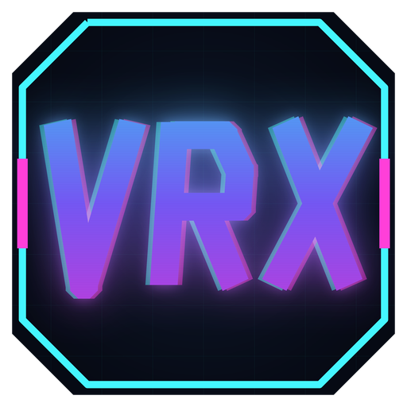

### [⬇ Download the latest release](https://github.com/pkellyuk/VRX/releases/latest)

[](https://github.com/pkellyuk/VRX/releases/latest)

# VRX

Play flat PC games on a stereo screen in VR using your keyboard and mouse.
VRX captures the selected game window, estimates depth, and creates a stereo
view. All settings live in a desktop app; no in-headset UI or motion controllers
are needed.

It is not only for games: attach to a browser window and any 2D video you play in
it — YouTube, a streaming service, your own files — becomes 3D on the same screen.

VRX is free and open source.

[](https://ko-fi.com/pkellyuk)

## Quick hints

From using VRX day to day:

- **Run the game at 1080p.** It is much more stable, and in the headset you will
  not notice the difference.
- **Single GPU:** the fast **ZipDepth** model with **Game frame timing → Delayed
  to depth** and **Steady depth — motion vectors** gives the best experience.
- **Second GPU:** set it as the **Depth GPU**, turn on **Fuse with Depth Anything
  V2**, and keep **Delayed to depth** with **Steady depth — motion vectors**.
- **Steam games: turn off Desktop Game Theatre.** If you start a normal Steam game
  while SteamVR is running, SteamVR also shows it on its own flat screen in front of
  VRX's. In Steam, right-click the game → **Properties → General** and untick **Use
  Desktop Game Theatre while SteamVR is active**.

## Get started

Download VRX v1.7.1: the [installer](https://github.com/pkellyuk/VRX/releases/download/v1.7.1/VRX-Setup-1.7.1.exe)
or the [portable ZIP](https://github.com/pkellyuk/VRX/releases/download/v1.7.1/VRX-1.7.1-win-x64.zip)
([release notes and checksums](https://github.com/pkellyuk/VRX/releases/tag/v1.7.1); older versions on
[GitHub Releases](https://github.com/pkellyuk/VRX/releases)).
For the portable version, extract the entire ZIP and run `VRX.Desktop.exe`.
Keep the bundled folders alongside the application.

1. Start SteamVR and set it as the active OpenXR runtime.
2. Start your game.
3. Open VRX, select the game process and window, and click **Attach / Play**.
4. Adjust screen placement, size, and stereo strength on the desktop.
5. Use **Stop VR** to finish.

The screen stays fixed in the room by default. **Equals (=)** recenters it;
**F8** requests dismissal of the SteamVR dashboard. Both keys are configurable
and also reach the game. An optional head-follow mode is available.

Settings save per game executable under `%LOCALAPPDATA%\VRX\profiles`.
Session logs are under `%LOCALAPPDATA%\VRX\sessions`.

## Requirements and limitations

- Windows 10 2004 or later / Windows 11, a DirectX 12 GPU, and an active OpenXR runtime.
- Tested with Helldivers 2, an RTX 3090, PSVR2, and SteamVR. Other combinations need validation.
- The packaged release includes the desktop runtime, native dependencies, and both depth models.
- Depth is estimated by [ZipDepth](https://github.com/fabiotosi92/ZipDepth) by default: about 6x less GPU time per estimate than Depth Anything V2 Small (2.0 vs 13.1 ms on an RTX 3090), which keeps depth much closer to the game's frame rate. Untick **Fast depth model — ZipDepth** (per game, applies live) to use Depth Anything V2 instead. Fast motion and foreground edges can still distort.
- **Depth GPU** (per game, applies at Attach / Play) chooses which graphics card runs the depth model: the game's own GPU (default), any other GPU automatically, or a specific card from the list. Cards are remembered by name, and identical cards by their order, because Windows' GPU numbering can change after driver updates; if the chosen card is missing, VRX uses the game's GPU and the setting shows it as not found. With another card, the capture step makes a small model-size copy of each frame and the game GPU's copy engine sends it across, so depth no longer competes with the game. Measured with the RTX 3090 saturated by other work: ZipDepth 7.7 ms per estimate on an RTX 3060 (vs 19.9 ms on the busy 3090), Depth Anything V2 25.6 ms (vs 120.5 ms). Foreground crop passes still use the game GPU.
- **Steady depth — motion vectors** (per game, default on, applies live) reduces depth shimmer. Each new depth estimate is blended with the previous one, which the graphics card's hardware motion estimator (its video engine, not the shader cores) moves to where things are now, but only where that motion is verified, so fast pans and occlusions fall back to the new estimate. It adds CPU work to each depth pass, which the session log reports. See [XMMODEL.md](XMMODEL.md).
- **Fuse with Depth Anything V2** (per game, default off, applies live, needs the fast depth model) runs Depth Anything V2 alongside ZipDepth. ZipDepth keeps depth fast; Depth Anything's more detailed layering is moved to the current frame with motion vectors, checked, and fitted onto ZipDepth region by region. It works best with another GPU as the depth GPU, and runs at most 10 times per second on one GPU. In the first headset test, fused and steadied depth together removed most of the "that looks wrong" moments. Offline: 59% closer to Depth Anything's layout than ZipDepth alone and 16% less flicker, or 36% less with steadying (XMMODEL.md).
- **Smooth depth steps (sub-pixel warp)** (per game, default on, applies live) removes depth banding. Whole-pixel stereo shifts give the entire scene only about 25 distinct depths at 1920 px wide, so a smoothly receding surface such as a field or a road is drawn as flat stripes with a 1 px step between them, which looks like ridges on uniform texture. Measured on a test field, the shift each row receives went from 25 flat bands with 1 px cliffs to 330 steps with a largest jump of 0.075 px. Turning it off restores the earlier warp, which is very slightly sharper. See [XBANDS.md](XBANDS.md).
- **Screen curve** (per game, applies live, 0% by default) wraps the screen around you like a curved television. A curved screen is drawn as a real cylinder for each eye from its tracked position, so its outline, perspective and the parallax when you move your head are all right; the top view in the desktop app draws the shape. 100% is a 70° wrap, further than any real screen (a curved monitor is about 40°): at the default screen (5.7 m wide at 3 m) the edges come 0.84 m nearer and reach 51° either side instead of 44°. SteamVR offers apps no cylinder layer, so VRX renders it; see [XCURVE.md](XCURVE.md).
- **Ambilight — glow around the screen** (per game, applies live, off by default) spreads the colours at the edge of the picture softly into the darkness around the screen, like the bias lighting behind a television: each point of the glow blends the whole border, the nearest part most, so it follows the local colour close in and softens further out. It rises from a thin dark bezel, fades out over 22% of the screen's width, wraps round a curved screen, and follows the scene smoothly rather than flickering. **Ambilight strength** sets its brightness. See [XCURVE.md](XCURVE.md).
- **World colour** (per game, applies live, black by default) colours the space around the screen: presets or any `#RRGGBB`. The ambilight glows over it.
- **Room — walls lit by the screen** (per game, applies live, off by default) puts you in a dark room whose walls, floor and ceiling are lit by the picture and the ambilight, like a television or a cinema screen in a dark room. The picture and the glow act as real area lights (a red edge on screen tints the nearby wall red), the glow lies on the wall behind the screen and wraps with a curved one, and the world colour becomes the room's house lights. The slider sets how pale the walls are; 30-60% looks like a cinema. The floor follows SteamVR's floor when it can, and the screen is kept level while the room is on. Needs the fixed screen. Below it, **Glass walls** turns the side walls, the back wall and the ceiling into glass in slim frames, looking out over a ground that runs to a horizon in the world colour; **Reflections** mirrors the screen, its glow and the room light in the glass and a polished floor, each eye tracing its own reflection; **Room light** adds a soft panel in the ceiling just above and behind you, and **Light colour** picks its colour from warm (2700 K) to daylight (6500 K). All four are per game, apply live, are off by default, and need the room and the fixed screen. With glass or reflections on, the floor gets subtle 1 m tiles (continued as a 1 m grid on the ground outside), so you can count the screen's size in metres. See [XROOM.md](XROOM.md).
- **Make base settings** (button, next to Reset this profile) saves the settings currently shown as the starting point for games you have not set up yet, including the depth options, depth GPU and shortcut keys but not the game's own path or window. Games that already have a profile are unaffected, and **Reset this profile** returns to the base (or VRX's defaults when no base is saved).
- **Apply to all** (button, next to Make base settings) copies the settings shown to every game you have already set up, after an OK/Cancel warning. Each game keeps its own path and window; a profile that cannot be read is left untouched; games not set up yet still start from the base settings.
- **Game frame timing** (per game, applies live) chooses which game frame is shown with the depth. **Latest frame** (default) is smooth and immediate, but depth lags slightly behind moving things. **Delayed to depth** holds the game image back by the measured depth delay so the two line up, while motion stays at the capture rate. **Matched to depth** (the earlier frame matching) shows each depth estimate with the exact frame it came from: the best alignment, but the game only updates at the depth rate. Offline on four clips with depth 67 ms behind, against the latest frame: delayed cut depth mismatch from 0.050 to 0.016 and improved edge alignment from 0.59 to 0.72, with 26 game updates per second against matched's 15. Delayed and matched both add delay, so they suit slower games. See [XSYNC.md](XSYNC.md).
- **Extra foreground depth passes** are experimental and default on; their benefit varies.
- GPU contention can reduce depth update speed. A steady 60 depth updates per second is not guaranteed.
- SteamVR dashboard dismissal is best-effort. The installer is unsigned.

## Build locally

The current build scripts expect Visual Studio Community at
`C:\Program Files\Microsoft Visual Studio\18\Community`, with C++ tools and a
Windows SDK, plus the .NET 10 SDK and SteamVR. Adjust `VCVARS` in
`bench/native/openxr/build.bat` if Visual Studio is installed elsewhere.

Native dependencies must be available in the user NuGet cache:
`Microsoft.ML.OnnxRuntime.DirectML` 1.24.4 and `Microsoft.AI.DirectML` 1.15.4.
Both models must exist in `bench/models`; model files are not tracked in Git.
The default ZipDepth model (`zipdepth_faithful_fp16_672x384.onnx`) is generated
by `bench/zipdepth_export.py`, whose header lists the one-time setup. The
Depth Anything V2 model is `model_fixed_686x392.onnx`.

From the repository root in PowerShell, run each build step and confirm it succeeds:

```powershell
cmd /c "bench\native\openxr\build.bat --desktop"
$env:LIB = ''
dotnet build desktop/VRX.Desktop/VRX.Desktop.csproj -c Release
```

Launch `desktop/VRX.Desktop/bin/Release/net10.0-windows/VRX.Desktop.exe`.
The native renderer is `bench/native/openxr/out/xrplayer.exe`.
The local renderer enables a best-effort GPU-priority boost; its
`--normal-gpu-priority` command-line option disables the experiment for comparisons.

To package an installer and portable ZIP, install Inno Setup 6 and run
`./release/build-release.ps1`. Outputs go into a fresh folder under `release/out`.
Third-party notices and license texts are retained under `release` and bundled
with the release.

## License

Copyright (C) 2026 Paul Kelly.

VRX is free software licensed under the [GNU General Public License v3.0](LICENSE):
you may use, study, share and modify it, and anything you distribute that is built
from it must also be released under the GPL with its source available. It comes with
no warranty.

The released packages also contain third-party components under their own licenses
(the depth models, ONNX Runtime, DirectML, the OpenXR loader and the .NET runtime):
see `release/THIRD-PARTY-NOTICES.txt` and `release/licenses`.
